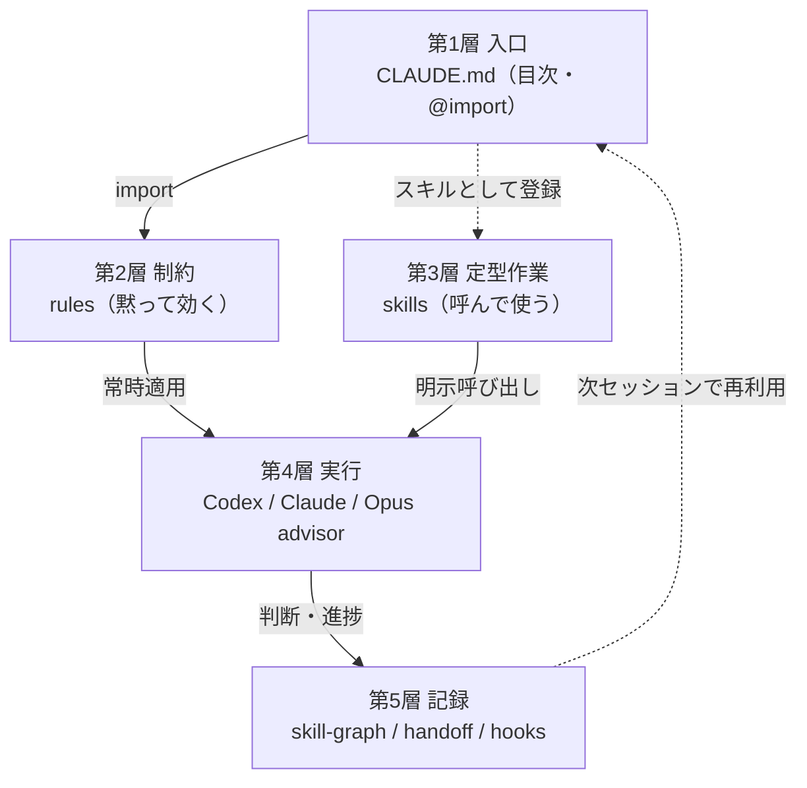
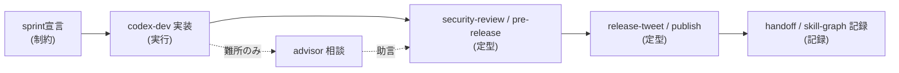

## はじめに

Claude Code と Codex を個人開発で数ヶ月使ううちに、運用を支える指示や設定がかなり増えました。グローバルのルールが18本、スキルが十数本、プロジェクト側にも記事用のルールとスキルがある。さらに Codex との役割分担、難所だけ上位モデルに相談する仕組み、設計判断を会話の外に残すノートまで足しました。

ここでいう「ハーネス」は、エージェントの運用を支える指示・設定・分担の総体のことです。便利だからと足し続けた結果、一覧はあるのに地図がない状態になりました。今どの部品が揃っていて、それぞれがいつ・どう連携して効くのか、自分でも俯瞰しづらい。新しいプロジェクトを始めるたびに「何を載せるか」で迷う。

以前 [Claude Code運用を数ヶ月で見直してrulesとskillsに分けた話](https://zenn.dev/harness/articles/claude-code-workflow-evolution) を書きましたが、あれは「何を入れて何を捨てたか」という変遷の物語でした。この記事はその続きではなく、**到達点の地図**です。今あるハーネスを5層に並べ直して、各層が何で、どう連携するかを一枚にします。

対象読者は、Claude Code や Codex を使い始めて rules・skills・hooks が増えてきたものの、全体像を持てていない個人開発者です。実例として、この記事を管理しているリポジトリ [harness17/zenn-articles](https://github.com/harness17/zenn-articles) の構成も出します。

なお、ハーネスにはキャリアや個人用のルール・スキルも混ざっていますが、この記事では汎用的な開発運用層だけを扱います。

## ハーネスの全体像（5層）

結論から先に出します。今のハーネスは、次の5層で見ると整理できました。



上から「入口 → 制約 → 定型作業 → 実行 → 記録」です。入口がルールを読み込み、ルールは黙って効き、定型作業は呼んだときだけ走り、実行層がそれらを使って手を動かし、結果が記録層に残って次のセッションへ戻る。以降、この順に各層を見ていきます。

ちなみに、層ではなく「いつ効くか」というトリガーで分類する手もありました。ただ、新しいプロジェクトを組むときは「いつ効くか」より「どの層の部品か」で考えた方が取捨選択しやすかったので、レイヤー軸にしています。トリガーの違いは第3層で表にして補います。

## 第1層 入口 — CLAUDE.mdは目次にする

導入直後は、ひとつの `CLAUDE.md` に運用ルールを全部書いていました。すぐに苦しくなり、今は本体を `rules/` に分けて、`CLAUDE.md` は目次に寄せています。

グローバル側はこういう形です。

```markdown
# グローバルルール
ユーザに同調せず、目的達成を優先する。

@rules/advisor-strategy.md
@rules/git-ops.md
@rules/security-coding.md
@rules/test-strategy.md
@rules/skill-graph-auto-register.md
@rules/handoff-capture.md
（…全18本を @import）
```

入口は2段構えです。グローバルの `CLAUDE.md` が全プロジェクト共通の18本を読み込み、プロジェクト側の `CLAUDE.md` がそのプロジェクト固有のルールを追加で読み込みます。このリポジトリなら記事用のルールがそれにあたります。

```markdown
@.claude/rules/topic-policy.md
@.claude/rules/writing-style.md
@.claude/rules/zenn-workflow.md
@.claude/rules/article-requirements.md
@.claude/rules/privacy.md
@.claude/rules/writing-process.md
@.claude/rules/cross-agent-review.md
@.claude/rules/article-fact-check.md
```

入口を目次にしておくと、「テスト方針だけ直す」「記事の守秘ルールだけ足す」という変更が、巨大な1ファイルを触らずに済みます。

## 第2層 制約 — rules（黙って効く）

第2層のルールは、こちらが呼ばなくても常時適用される制約です。数が増えると1本ずつでは把握できないので、機能グループで持っています。

| グループ | 主なルール | 役割 |
|----------|-----------|------|
| 開発規律 | git-ops / sprint-contract / karpathy-coding-principles / comand-check | 実装前の合意と、触る範囲の制御 |
| 品質・安全 | test-strategy / perf-review / security-coding / data-design-review | テスト観点・性能・セキュリティ・データ設計 |
| 外部連携・運用 | api-quota-design / advisor-strategy / agent-browser / deverop-after | APIクォータ設計・助言・ブラウザ検証 |
| 記録・メタ | handoff-capture / handoff-archive / skill-graph-auto-register / privacy-personal-info | 引き継ぎ・知識の永続化・守秘 |

たとえば実装に入る前に完成条件を宣言させる `sprint-contract` は、こんな制約です。

```markdown
【スプリントコントラクト】
実装内容：〇〇機能を追加する
完成条件：
- 条件1（正常系）
- 条件2（権限・認可）
- 条件3（異常系・エラー処理）
→ 上記を確認後に実装開始
```

この層には、これとは別にキャリア・個人用のルールもありますが、本記事では扱いません。各ルールの詳細は別記事に書いていて、たとえば [@importでCLAUDE.mdを分割した話](https://qiita.com/harnesswinner/items/6678320489deec25113a)、[Surgical Changesで無関係コードを触らせない話](https://qiita.com/harnesswinner/items/e8ac450dbfd60757f487)、[Sprint Contract運用](https://qiita.com/harnesswinner/items/98669d5afa40d36299d5) が、この第2層の中身にあたります。

## 第3層 定型作業 — skills（呼んで使う）

ルールが「黙って効く」のに対して、スキルは「呼んだときだけ走る」定型作業です。繰り返す手順をスキルに寄せて、依頼の言葉を短くしました。

グローバルには `sprint` / `security-review` / `pre-release` / `codex-dev` / `handoff-cleanup` / `release-tweet` などがあり、このリポジトリには記事用の `article-plan` / `article-review` / `article-publish` と、その Qiita 版があります。

ここで大事なのは、層ごとに発火条件が違うことです。

| 種類 | 発火条件 | 例 |
|------|----------|-----|
| rules | 常時適用（黙って効く） | git-ops, security-coding |
| skills | 明示的に呼び出す | /article-review, /pre-release |
| hooks | ツール実行時に自動 | 保存時の文体チェック |
| advisor | 難所だけ相談 | アーキテクチャ・セキュリティ判断 |

hooks は「自動で走る層」です。このリポジトリでは、記事を保存したときに文体のNG語を警告するフックを入れています。

```json
{
  "hooks": {
    "PostToolUse": [
      {
        "matcher": "Write|Edit",
        "hooks": [
          { "type": "command", "command": "bash .claude/hooks/check-article-style.sh 2>/dev/null || true", "timeout": 10 }
        ]
      }
    ]
  }
}
```

「候補Nの記事を書こう」と言えば、テーマ選定方針・記事要件・文体ルール・公開ゲートを読みながら進められる。毎回「GitHubリンクを入れて、5行以上のコードを入れて、公開はfalseで」と説明しなくて済むようになりました。

## 第4層 実行 — agent分担とadvisor

手を動かす層です。全部を1モデルでやるのではなく、役割で分けています。

| エージェント | 位置づけ | 向いていた作業 |
|------|--------|----------------|
| Codex | 実装担当 | ファイル編集・テスト・記事初稿 |
| ClaudeCode | 設計・レビュー担当 | 方針整理・候補出し・別視点の確認 |
| Opus（advisor） | 難所の助言役（実行はしない） | アーキテクチャ・セキュリティ判断の相談 |

advisor を呼ぶのは、アーキテクチャ判断・セキュリティ判断・根本原因が難しいバグなど、別視点が効く局面に絞りました。通常の編集や明らかな修正まで相談すると遅くなるからです。

記事については、作成したエージェント自身だけで公開判断を完結させないよう、相互レビューをゲートにしています。

| 作成者 | レビュー担当 |
| --- | --- |
| Codex | ClaudeCode |
| ClaudeCode | Codex |

この分担の詳細は [Codex と Claude Code の共同作業ハーネス](https://zenn.dev/harness/articles/cross-agent-harness-introduction) や [Sonnet実行+Opus助言パターン](https://qiita.com/harnesswinner/items/4fec7b6a995f70858cfa) に書いています。

## 第5層 記録 — 判断を会話の外に出す

最後は記録層です。その場のチャットで「AではなくBにした」と決めても、数週間後には理由が薄れます。後で記事にするにも、設計判断は会話の外に残しておかないと弱い。

そこで設計判断は、命題文をタイトルにしたノートで残しています。

```markdown
---
description: "判断の要旨を1文で"
alternatives: "検討した代替案"
rationale: "この選択をした理由"
status: active
type: decision
created: YYYY-MM-DD
---

# <命題文>

## 判断の内容
## 検討した代替案
## この選択の根拠
## 注意点・トレードオフ
```

これは設計判断を記録するための汎用的な仕組みで、ノートそのものの中身（具体的な案件名など）は出しません。次のセッションや別エージェントへの引き継ぎは `handoff` に、保存時の自動チェックは `hooks` に分かれています。記録層の詳細は [設計判断を My-Skill-Graph に残して再利用する話](https://zenn.dev/harness/articles/codex-claude-skill-graph-worklog) や [session-briefで長期記憶を軽く保つ話](https://zenn.dev/harness/articles/ai-agent-session-brief-memory) にまとめています。

## 1タスクを5層に流すとどう動くか

ここまでは静的な地図でした。実際に1タスクを流すと、5層は別々の道具ではなく1本の流れになります。たとえば「ブラウザ拡張に小機能を足して公開する」だと、こう進みます。



最初に `sprint` で完成条件を宣言し（第2層の制約に従って第3層のスキルを呼ぶ）、Codex が実装し（第4層）、設計に迷ったら advisor に相談し、`security-review` と `pre-release` で確認し、公開して、最後に判断と引き継ぎを記録層に残す。各層を上から下へ一度通っていることが分かります。

この「一度通す」流れが頭に入っていると、新しいプロジェクトでも「この層から何を載せるか」で部品を選べるようになりました。

## まとめ

数ヶ月積み上げたハーネスを地図にして、3つに整理できました。

- ハーネスは「入口 → 制約 → 定型作業 → 実行 → 記録」の5層で俯瞰できる
- rules（黙って効く）/ skills（呼ぶ）/ hooks（自動）/ advisor（難所）で発火条件が違う
- 増えた部品は種類で整理し、新規プロジェクトでは層単位で取捨選択する

この記事は「今どうなっているか（WHAT）」の地図でした。次は「ゼロからどう組むか（HOW）」の再現手順と、「なぜこの形にするのか（WHY）」の設計思想を、それぞれ別記事にする予定です。

## 参考リンク

- [harness17/zenn-articles](https://github.com/harness17/zenn-articles) — この記事を管理しているリポジトリ。`.claude/rules/` や `skills/` の実例
- [テーマ選定方針 topic-policy.md](https://github.com/harness17/zenn-articles/blob/main/.claude/rules/topic-policy.md) — 第2層 rules の実物の一例
- [Claude Code運用を数ヶ月で見直してrulesとskillsに分けた話](https://zenn.dev/harness/articles/claude-code-workflow-evolution) — 前回記事。今回の地図に至るまでの「変遷の物語」
