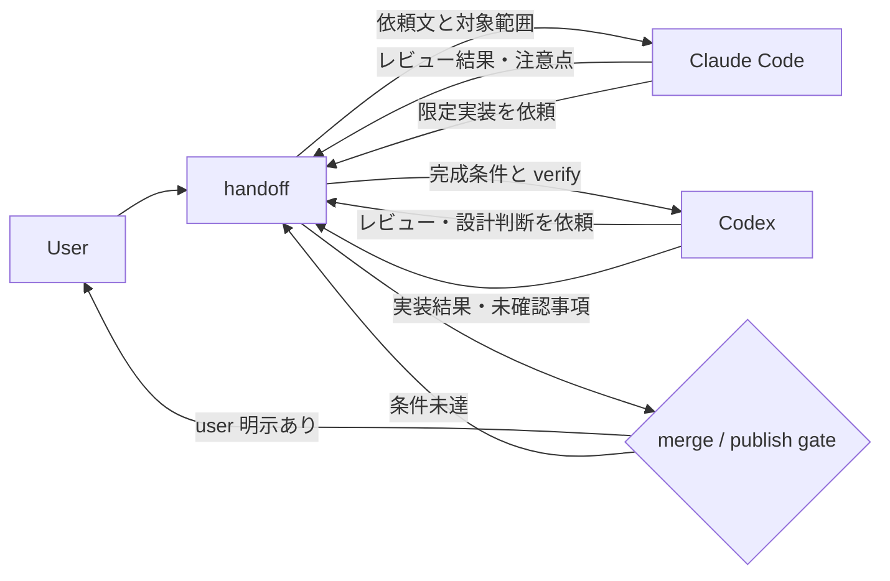

# CodexからClaude Codeを、Claude CodeからCodexを呼び出すハーネスを組んだ話

## メタ情報
- type: tech
- topics: [ai, codex, claude, workflow, automation]
- 想定文字数: 3000〜4000字
- 想定執筆時間: 4〜5時間
- ステータス: 構成中
- 位置づけ: `cross-agent-harness-introduction` の続編候補

## 方針チェック

- OKパターン: 「Codex と Claude Code を併用していたが、片方で作業している最中にもう片方へレビューや実装を渡す手順が毎回手作業だった」→ 相互呼び出し用のハーネスを組み、依頼文、作業範囲、結果の戻し方を固定した体験記事。
- NGに寄せない: 「AI エージェント比較」「Codex と Claude Code の使い方」「自律エージェント入門」の網羅解説にはしない。
- 既存記事との差分:
  - `cross-agent-harness-introduction.md`: 共同開発ハーネス全体の目的、構成、導入手順が主題。
  - `ai-cross-review-handoff-workflow.md`: Zenn 記事レビューで別エージェントを使う運用が主題。
  - 本記事: **Codex から Claude Code、Claude Code から Codex を呼び出すために、CLI 呼び出し・依頼文・handoff 更新をどうハーネス化したか**が主題。

## 想定読者

Codex と Claude Code を同じリポジトリで併用していて、「今の作業をもう片方のエージェントにレビューさせたい」「設計だけ Claude Code に渡して、実装は Codex に戻したい」と感じている個人開発者。

## 読者前提と補足する用語

- 既知として扱うこと:
  - Git 管理されたプロジェクトで AI コーディングエージェントを使っていること
  - Codex CLI と Claude Code を、どちらもターミナルから起動できること
  - `AGENTS.md` / `CLAUDE.md` のようなプロジェクト指示ファイルの概念
- 本文で補足する用語:
  - handoff: 作業依頼、実施結果、未確認事項、レビュー結果を残す共有メモ
  - ハーネス: 共同作業に必要なルール、テンプレート、skills、呼び出しスクリプトをまとめたキット
  - 相互呼び出し: 片方のエージェントの作業中に、もう片方の CLI へ限定された依頼を渡し、結果を handoff に戻す運用
- 初心者向け問題設定:
  - Codex と Claude Code は同じリポジトリで使えるが、何も決めずに併用すると「どちらが主担当か」「依頼範囲はどこまでか」「結果をどこへ戻すか」が曖昧になる。単に CLI を起動するだけでは共同開発にならず、片方がもう片方の作業を上書きしたり、レビュー結果が会話ログに埋もれたりする。

## 構成

### はじめに（250〜350字）
- 伝えること: `cross-agent-harness` を作った後、次に欲しくなったのは「共同作業ルール」だけでなく、Codex と Claude Code を相互に呼び出す実行導線だった。
- 具体例: Codex 作業中に Claude Code へレビューを依頼する、Claude Code の設計から Codex へ実装タスクを渡す。
- 想定文字数: 300字
- 前後の接続: 先行記事が「置き場所を作った話」で、本記事は「もう片方へ作業を渡す導線を作った話」と説明する。

### 本論セクション1: 2つのAIを開くだけでは共同開発にならなかった
- 伝えること: Codex と Claude Code を別々に起動できても、依頼範囲と結果の戻し先が曖昧だと作業がつながらない。
- 具体例:
  - Codex で実装した後、Claude Code にレビューしてほしいが、どの差分を見せるか毎回迷う
  - Claude Code で設計した後、Codex に実装してほしいが、完成条件と触ってよい範囲を毎回書き直す
  - レビュー結果が片方の会話ログにだけ残り、次の作業者が読めない
- 想定文字数: 500〜700字
- 前後の接続: 問題を「呼び出しコマンド」ではなく「作業契約つきの呼び出し」として扱う流れへつなぐ。

### 本論セクション2: 呼び出しの最小単位を handoff にした
- 伝えること: 相互呼び出しでは、プロンプトをその場で長く書くのではなく、handoff に依頼、完成条件、触ってよい範囲、verify、戻し方を置く。
- 具体例:
  - Codex → Claude Code: 実装差分のレビュー、リスク確認、追加修正の要否判断
  - Claude Code → Codex: 実装範囲が明確なタスク、テスト追加、差分の具体化
  - どちらの呼び出しでも、結果は handoff に追記して戻す
- 想定文字数: 600〜800字
- 前後の接続: その handoff をどう CLI 呼び出しに渡すかへ進む。

### 本論セクション3: CodexからClaude Codeを呼び出す導線
- 伝えること: Codex 側から Claude Code を呼び出すときは、レビューや設計判断など、実装者とは違う視点が必要なタスクに絞った。
- 具体例:
  - 最新 handoff と対象ファイルを前提に、Claude Code へレビュー依頼を投げる
  - 依頼文には「触ってよい範囲」「直してよいか、レビューだけか」「結果の記録先」を入れる
  - Claude Code が勝手に publish / push しないよう、ゲート条件を明記する
- 想定文字数: 700〜900字
- 前後の接続: 反対方向の Claude Code → Codex では、実装タスクへ寄せる違いを説明する。

### 本論セクション4: Claude CodeからCodexを呼び出す導線
- 伝えること: Claude Code 側から Codex を呼び出すときは、限定された実装、テスト、機械的修正に寄せた。
- 具体例:
  - Claude Code が設計・レビュー観点を整理し、Codex 用の実装依頼に変換する
  - Codex は handoff、profile、未コミット差分を読んでから作業する
  - 実装後は verify 結果と未確認事項を handoff に戻す
- 想定文字数: 700〜900字
- 前後の接続: 双方向にしたことで起きる危険と、止める条件へつなぐ。

### 本論セクション5: 双方向にしたからこそ、呼び出し制限を置いた
- 伝えること: 相互呼び出しは便利だが、無制限にすると責任境界が崩れる。呼び出してよいタスクと止めるタスクを分けた。
- 具体例:
  - OK: レビュー、限定実装、テスト追加、差分要約
  - NG: merge / publish / push の最終判断、破壊的変更、対象外ファイルのついで修正
  - ゲート: セルフ verify、反対側レビュー、重大指摘なし、ユーザー明示
- 想定文字数: 600〜800字
- 前後の接続: ハーネス化しても人間判断を残すというまとめへつなぐ。

### まとめ（150〜250字）
- 要点3つ:
  - Codex と Claude Code を同時に使うだけでは、作業はつながらない。
  - 相互呼び出しの単位を handoff にすると、依頼範囲、完成条件、戻し先が固定できる。
  - 双方向に呼べるようにするほど、merge / publish / destructive change の人間ゲートを明確にする必要がある。

## 図表・比較表の予定

### 相互呼び出し図

### 呼び出し方向ごとの役割

| 方向 | 主な用途 | 渡すもの | 戻すもの |
| --- | --- | --- | --- |
| Codex → Claude Code | レビュー、設計リスク確認、公開前判断材料 | 差分、対象ファイル、レビュー観点、触ってよい範囲 | 指摘、重大度、修正要否、未確認事項 |
| Claude Code → Codex | 限定実装、テスト追加、機械的修正 | 完成条件、対象ファイル、verify コマンド、禁止事項 | 変更内容、verify 結果、残課題 |

### 自動化する / しない

| 対象 | ハーネス化する | 人間判断に残す |
| --- | --- | --- |
| 呼び出し | CLI 起動、依頼文テンプレート、handoff 参照 | どちらに渡すかの最終判断 |
| 作業範囲 | 触ってよいファイル、禁止事項 | 対象外修正の許可 |
| 結果記録 | handoff への追記形式 | 指摘を採用するか |
| 公開 / merge | ゲート条件の確認 | publish / push / merge の実行判断 |

## コード例の準備状況

| セクション | コード言語 | 出典 | 準備状況 |
| --- | --- | --- | --- |
| Codex → Claude Code 呼び出し | powershell / markdown | `cross-agent-harness` 側の呼び出しスクリプトまたは skill | 要確認 |
| Claude Code → Codex 呼び出し | powershell / markdown | `cross-agent-harness` 側の呼び出しスクリプトまたは skill | 要確認 |
| handoff テンプレート | markdown | `CLAUDE_CODE_HANDOFF.md` / `cross-agent-harness` template | 確認済み、引用範囲選定が必要 |
| 呼び出し制限 | markdown | `cross-agent-review` / `project-collaboration-profile` 系ルール | 確認済み、引用範囲選定が必要 |

## 事実確認メモ

- `cross-agent-harness-introduction` では、Claude Code 側 skill と Codex 側 skill を分けたこと、handoff を共有ログにしたことまでは紹介済み。
- 本記事では、それをさらに進めて「片方のエージェントからもう片方を呼ぶ実行導線」に焦点を絞る。
- 本文化前に、`harness17/cross-agent-harness` 側で実際に追加した呼び出しスクリプト、skill、コマンド名、コミットを確認する。
- 実装がローカル未公開の場合は、公開できる範囲のコード例に絞り、秘密情報やローカル絶対パスを出さない。

## 参考リンク候補

- [harness17/cross-agent-harness](https://github.com/harness17/cross-agent-harness)
- [CodexとClaude Codeの共同作業をcross-agent-harnessに切り出した](https://zenn.dev/harness/articles/cross-agent-harness-introduction)
- [AI 2 台クロスレビューで技術記事の盲点を拾う](https://zenn.dev/harness/articles/ai-cross-review-handoff-workflow)
- [harness17/zenn-articles](https://github.com/harness17/zenn-articles)

## 次のアクション

- `cross-agent-harness` 側の最新差分を確認し、相互呼び出しを示すコードまたは skill 手順を 1〜2 個選ぶ。
- Codex → Claude Code と Claude Code → Codex のどちらを先に本文で説明するか、実コードの分かりやすさで決める。
- 本文化する場合は `articles/cross-agent-harness-automation.md` を `published: false` で作成する。
