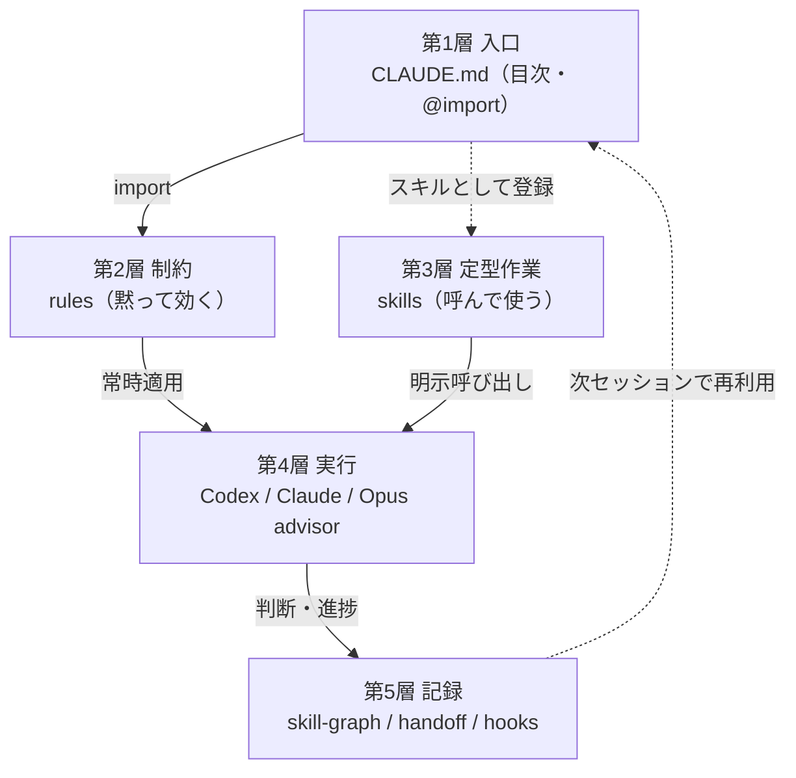
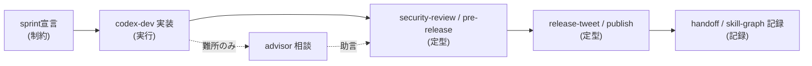

## この記事の結論

Claude Code / Codex を数ヶ月使うと、rules・skills・hooks が増えて「一覧はあるが地図がない」状態になります。増えた部品は、次の5層に並べ直すと整理できました。



この記事は、各層が何で、どう連携するかを整理したものです。対象は、Claude Code や Codex を使い始めて rules・skills・hooks が増えたが、全体像を持てていない個人開発者です。「ハーネス」はエージェントの運用を支える指示・設定・分担の総体を指します。

実例として、この記事を管理しているリポジトリ [harness17/zenn-articles](https://github.com/harness17/zenn-articles) の構成を使います。なお、ハーネスにはキャリアや個人用のルールも混ざっていますが、ここでは汎用的な開発運用層だけを扱います。

## 第1層 入口 — CLAUDE.mdは目次にする

導入直後はひとつの `CLAUDE.md` に全部書いていました。すぐに苦しくなり、今は本体を `rules/` に分けて `CLAUDE.md` を目次にしています。

```markdown
# グローバルルール
ユーザに同調せず、目的達成を優先する。

@rules/advisor-strategy.md
@rules/git-ops.md
@rules/security-coding.md
@rules/test-strategy.md
@rules/skill-graph-auto-register.md
@rules/handoff-capture.md
（…全18本を @import）
```

入口は2段構えです。グローバルの `CLAUDE.md` が全プロジェクト共通の18本を読み込み、プロジェクト側の `CLAUDE.md` が固有のルールを追加で読み込みます。目次にしておくと、「テスト方針だけ直す」が巨大な1ファイルを触らずに済みます。

## 第2層 制約 — rules（黙って効く）

ルールは、呼ばなくても常時適用される制約です。数が増えると1本ずつでは把握できないので、機能グループで持ちます。

| グループ | 主なルール | 役割 |
|----------|-----------|------|
| 開発規律 | git-ops / sprint-contract / karpathy-coding-principles / comand-check | 実装前の合意と触る範囲の制御 |
| 品質・安全 | test-strategy / perf-review / security-coding / data-design-review | テスト観点・性能・セキュリティ・データ設計 |
| 外部連携・運用 | api-quota-design / advisor-strategy / agent-browser / deverop-after | APIクォータ設計・助言・ブラウザ検証 |
| 記録・メタ | handoff-capture / handoff-archive / skill-graph-auto-register / privacy-personal-info | 引き継ぎ・知識の永続化・守秘 |

たとえば実装前に完成条件を宣言させる `sprint-contract` はこんな制約です。

```markdown
【スプリントコントラクト】
実装内容：〇〇機能を追加する
完成条件：
- 条件1（正常系）
- 条件2（権限・認可）
- 条件3（異常系・エラー処理）
→ 上記を確認後に実装開始
```

## 第3層 定型作業 — skills（呼んで使う）

ルールが「黙って効く」のに対し、スキルは「呼んだときだけ走る」定型作業です。繰り返す手順をスキルに寄せて、依頼の言葉を短くしました。

ここで大事なのは、層ごとに発火条件が違うことです。

| 種類 | 発火条件 | 例 |
|------|----------|-----|
| rules | 常時適用（黙って効く） | git-ops, security-coding |
| skills | 明示的に呼び出す | /article-review, /pre-release |
| hooks | ツール実行時に自動 | 保存時の文体チェック |
| advisor | 難所だけ相談 | アーキテクチャ・セキュリティ判断 |

hooks は「自動で走る層」です。このリポジトリでは、記事を保存したときに文体のNG語を警告するフックを入れています。

```json
{
  "hooks": {
    "PostToolUse": [
      {
        "matcher": "Write|Edit",
        "hooks": [
          { "type": "command", "command": "bash .claude/hooks/check-article-style.sh 2>/dev/null || true", "timeout": 10 }
        ]
      }
    ]
  }
}
```

## 第4層 実行 — agent分担とadvisor

手を動かす層です。全部を1モデルでやらず、役割で分けています。

| エージェント | 位置づけ | 向いていた作業 |
|------|--------|----------------|
| Codex | 実装担当 | ファイル編集・テスト・記事初稿 |
| ClaudeCode | 設計・レビュー担当 | 方針整理・候補出し・別視点の確認 |
| Opus（advisor） | 難所の助言役（実行はしない） | アーキテクチャ・セキュリティ判断の相談 |

advisor を呼ぶのは、別視点が効く局面に絞りました。通常の編集まで相談すると遅くなるからです。記事については、作成したエージェント自身だけで公開判断を完結させないよう、相互レビュー（作成者≠レビュアー）をゲートにしています。

## 第5層 記録 — 判断を会話の外に出す

その場のチャットで「AではなくBにした」と決めても、数週間後には理由が薄れます。後で記事にするにも、設計判断は会話の外に残しておかないと弱い。そこで設計判断は、命題文をタイトルにしたノートで残しています。

```markdown
---
description: "判断の要旨を1文で"
alternatives: "検討した代替案"
rationale: "この選択をした理由"
status: active
type: decision
---

# <命題文>

## 判断の内容
## 検討した代替案
## この選択の根拠
```

これは設計判断を記録するための汎用的な仕組みで、ノートの中身（具体的な案件名など）は出しません。次セッションへの引き継ぎは `handoff`、保存時の自動チェックは `hooks` に分かれています。

## 1タスクを5層に流すとどう動くか

静的な地図を、1タスクで縦に通すと、5層は1本の流れになります。たとえば「ブラウザ拡張に小機能を足して公開する」だと、こう進みます。



最初に `sprint` で完成条件を宣言し、Codex が実装し、迷ったら advisor に相談し、`security-review` と `pre-release` で確認し、公開して、最後に判断と引き継ぎを記録層に残す。各層を上から下へ一度通っています。

## まとめ

- ハーネスは「入口 → 制約 → 定型作業 → 実行 → 記録」の5層で俯瞰できる
- rules（黙って効く）/ skills（呼ぶ）/ hooks（自動）/ advisor（難所）で発火条件が違う
- 増えた部品は種類で整理し、新規プロジェクトでは層単位で取捨選択する

「ゼロからどう組むか」「なぜこの形にするのか」は別記事に分ける予定です。運用を変えてきた変遷そのものは、Zenn版の元記事 [Claude Code運用ハーネスの現在地 — rules/skills/agentを5層の地図にした](https://zenn.dev/harness/articles/claude-code-harness-layer-map) と、その前の [Claude Code運用を数ヶ月で見直してrulesとskillsに分けた話](https://zenn.dev/harness/articles/claude-code-workflow-evolution) にまとめています。

## 参考リンク

- [harness17/zenn-articles](https://github.com/harness17/zenn-articles) — この記事を管理しているリポジトリ（rules / skills の実例）
- [Zenn版の元記事](https://zenn.dev/harness/articles/claude-code-harness-layer-map) — 同じ内容をやや詳しく書いたもの
